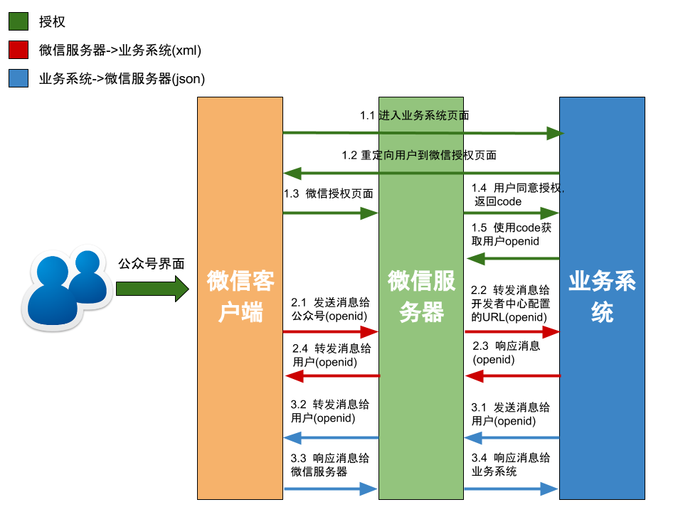

# Wechat

轻量的微信公众号组件(A Lightweight Wechat Component)
---

+ 包引入
	
	```xml
	<dependency>
        <groupId>me.hao0</groupId>
        <artifactId>wechat</artifactId>
        <version>1.5.0</version>
    </dependency>
	```
	
+ 依赖包，注意引入项目时是否需要**exclude**:

	```xml
	<dependency>
        <groupId>com.github.kevinsawicki</groupId>
        <artifactId>http-request</artifactId>
        <version>6.0</version>
    </dependency>
    <dependency>
        <groupId>com.fasterxml.jackson.core</groupId>
        <artifactId>jackson-databind</artifactId>
        <version>2.4.2</version>
    </dependency>
    <!-- 1.3.0之后引入 -->
    <dependency>
        <groupId>com.google.guava</groupId>
        <artifactId>guava</artifactId>
        <version>18.0</version>
    </dependency>
	```

+ 业务系统与微信公众号交互图阐述:

	

+ API基本用法:

	```java
	Wechat wechat = 
		WechatBuilder.newBuilder("appId", "appSecret")
						.conf1()  // 其他可选配置
						...
						.build();
	// 同步调用
	wechat.module().api();
	
	// 异步调用
	wechat.module().api(Callback<T>);
	```	

+ Wechat已实现以下组件:

	+ <a>基础</a>: ```base()```
	+ <a>用户</a>: ```user()```
	+ <a>菜单</a>: ```menu()```
	+ <a>多客服</a>: ```cs()```
	+ <a>消息</a>: ```msg()```
	+ <a>二维码</a>: ```qr()```
	+ <a>素材</a>: ```material()```
	+ <a>JS调用相关</a>: ```js()```
	+ <a>数据统计</a>: ```data()```

+ API使用文档见[这里](API.md)
		
+ 组件扩展: 如果想自己扩展组件，可以继承``Component``，调用``register``:
	
	```java
	public class MyComponent extends Component {
	    // ...
	}
	MyComponent myComp = new MyComponent();
   wechat.register(myComp);
	```
	
+ **AccessToken管理**:
	
	> 由于微信服务器限制**AccessToken**请求次数，并且频繁请求**AccessToken**并不是一个明智之举，需要将获取的**AccessToken**保存下来，待过期时，再去请求新的**AccessToken**，所以以上API均提供了无accessToken版本，如:
	
	```java
	List<String> ip();
	List<String> ip(String accessToken);
	```

+ 实现```AccessTokenLoader```: 

	```java
	public interface AccessTokenLoader {

	    /**
	     * 获取accessToken
	     * @return accessToken，若""或NULL会重新从微信获取accessToken，并触发refresh方法
	     */
	    String get();
	
	    /**
	     * 刷新accessToken，实现时需要保存一段时间，以免频繁从微信服务器获取
	     * @param token 从微信获取的新AccessToken
	     */
	    void refresh(AccessToken token);
	}
	```	

+ 默认的AccessTokenLoader实现(<font color="red">**生产环境不推荐使用**</font>):

	```java
	public class DefaultAccessTokenLoader implements AccessTokenLoader {
	
	    private volatile AccessToken validToken;
	
	    @Override
	    public String get() {
	        return (validToken == null
	                || Strings.isNullOrEmpty(validToken.getAccessToken())
	                || System.currentTimeMillis() > validToken.getExpiredAt()) ? null : validToken.getAccessToken();
	    }
	
	    @Override
	    public void refresh(AccessToken token) {
	        validToken = token;
	    }
	}
	```
	
+ **Ticket管理**: 同AccessToken类似，需自己实现接口``TicketLoader``: 

	```java
	public interface TicketLoader {

	    /**
	     * 获取Ticket
	     * @param type ticket类型
	     *             @see me.hao0.wechat.model.js.TicketType
	     * @return 有效的ticket，若返回""或null，则重新从微信请求Ticket，并触发refresh方法
	     */
	    String get(TicketType type);
	
	    /**
	     * 刷新Ticket
	     * @param ticket 从微信获取的新Ticket
	     */
	    void refresh(Ticket ticket);
	}
	```	

+ 默认的TicketLoader实现(<font color="red">**生产环境不推荐使用**</font>):

	```java
	public class DefaultTicketLoader implements TicketLoader {

	    private final Map<TicketType, Ticket> tickets = new ConcurrentHashMap<>();
	
	    @Override
	    public String get(TicketType type) {
	        Ticket t = tickets.get(type);
	        return (t == null
	                || Strings.isNullOrEmpty(t.getTicket())
	                || System.currentTimeMillis() > t.getExpireAt()) ? null : t.getTicket();
	    }
	
	    @Override
	    public void refresh(Ticket ticket) {
	        tickets.put(ticket.getType(), ticket);
	    }
	}
	```

+ 具体例子，可见[测试用例](https://github.com/ihaolin/wechat/blob/master/src/test/java/me/hao0/wechat/WechatTests.java)。

+ 历史版本

	+ 1.0.0:
		
		* 基础功能实现。
	
	+ 1.1.0:
		
		* 实现代码简化，个别类访问权限修改;
		* 实现<a href="#material-api">MATERIAL</a>组件。

	+ 1.2.0:

		* 废弃~~``Wechat.newWechat``~~构建方法，替换为``WechatBuilder``方式。
		* ``*Loader``设置过期时刻。
		* 实现<a href="#jssdk-api">JSSDK</a>组件。

	+ 1.3.0:
		
		+ 引入[guava](https://github.com/google/guava)。
		+ API支持异步调用。
		
	+ 1.4.0:
		
		+ 组件懒加载。
		+ 改变组件访问方式，由~~变量~~到**方法**。

	+ 1.5.0:
		
		+ 上传客服头像。
		+ 消息转发客服接口移至消息模块。
		+ 实现<a href="#data-api">DATA</a>组件。
		
+ 微信相关文档

	+ [公众号接口权限说明](http://mp.weixin.qq.com/wiki/8/71e1908fa08e67c6251ebdd78fd6b6b4.html)
	+ [接口频率限制说明](http://mp.weixin.qq.com/wiki/0/2e2239fa5f49388d5b5136ecc8e0e440.html)
	+ [接口返回码说明](http://mp.weixin.qq.com/wiki/17/fa4e1434e57290788bde25603fa2fcbd.html)	
	+ [报警排查指引](http://mp.weixin.qq.com/wiki/13/8348156d0e25c9e27b21462322d41149.html)

+ 你是好人

	+ 倘若你钱多人傻花不完，小弟乐意效劳😊，掏出你的**微信神器**做回好人吧:
		
		
	
	+ 倘若你还不够尽兴，继续掏出你的**支付宝神器**，疯狂扫吧:

		
        